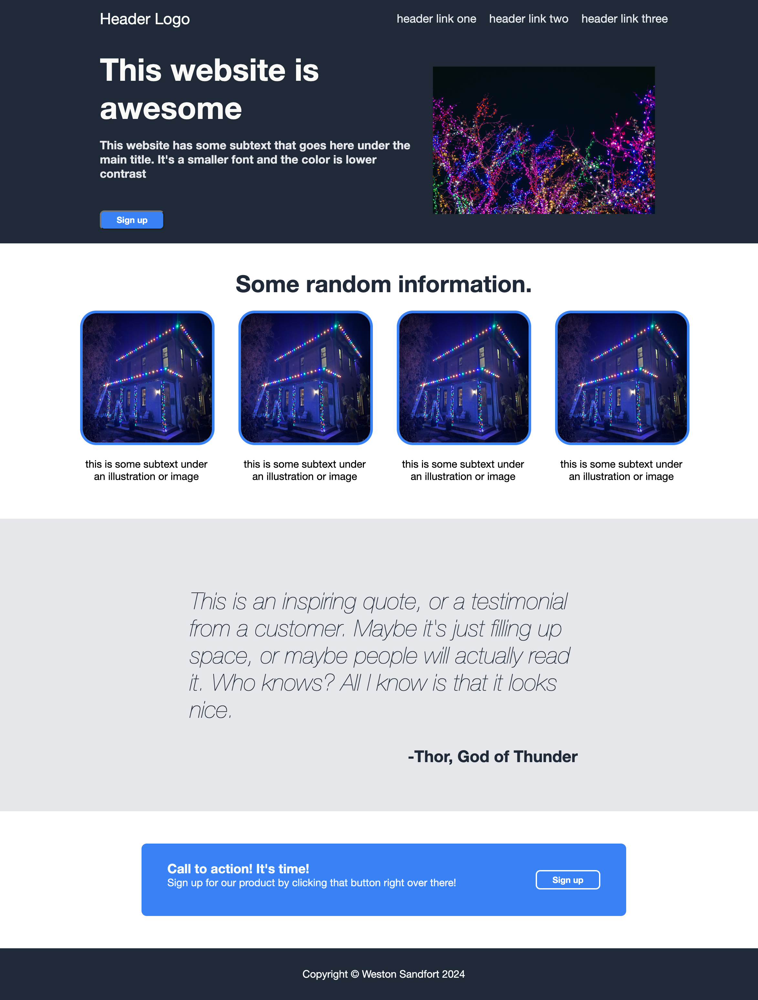
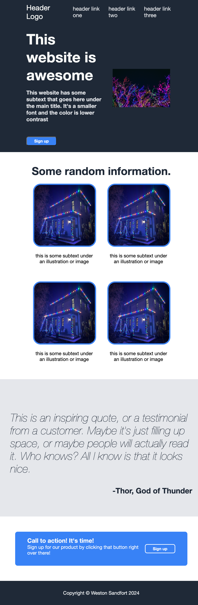

# landing-page
Landing page project for Odin Project (CSS Practice)

This was my first real forray into using flex-box. Coming out of a back-end development program,
I had somehow avoided really messing with it until now. There are some issues for sure--I was not,
for example, able to get the picture on the header to line up with the links whilst preserving shrinking, but I am reasonably satisfied with this attempt, at least for learning purposes. 

It can be viewed here: https://sandfortw.github.io/landing-page/
 
My website (large):
 

My website (small): 
 

The image I was to copy: 
 

